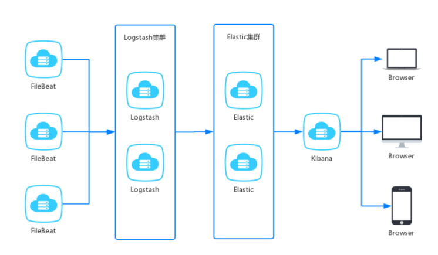
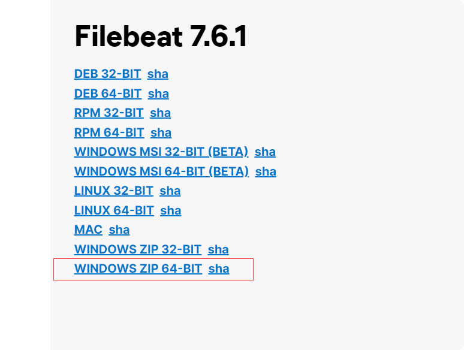
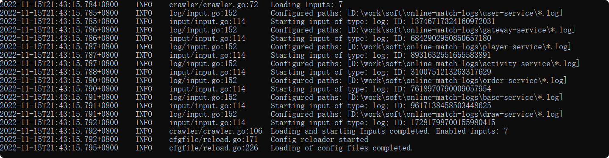

# 集成ELKF收集日志

名称|简述
--|--
filebeat|轻量级的开源日志文件数据搜集器，负责对服务的日志进行收集。
logstash|数据收集引擎，可以对数据进行过滤、分析、丰富、统一格式等操作，存储到用户指定的位置，包含但不限于文件、 elasticsearch 。
elasticsearch|存储、搜索和分析引擎，特点是高可伸缩、高可靠和易管理等。
kibana|数据分析和可视化平台，通常依赖 elasticsearch 。

> 环境版本

Docker 镜像版本： 7.6.1。

logstash:7.6.1
kibana:7.6.1
elasticsearch:7.6.1
store/elastic/filebeat:7.6.1

>路线
   
FileBeat 收集日志、Logstash 解析格式化、Elasticsearch 存储、Kibana 分析、发出告警。
   
## docker-compose安装elkf

### 文件树
cd /usr/local  

### 容器编排配置 docker-compose.yml
  
    version: "3.2"
    services:
     filebeat:
      image: elastic/filebeat:7.12.1
      volumes:
       - /usr/local/elkf/filebeat/data:/usr/share/filebeat/data
       - /usr/local/elkf/filebeat/filebeat.yml:/usr/share/filebeat/filebeat.yml
       - /usr/local/elkf/filebeat/logs:/usr/share/filebeat/logs
      links:
        - logstash
      container_name: filebeat
      user: "root"
     elasticsearch:
      image: elasticsearch:7.12.1
      ports:
        - "9200:9200"
        - "9300:9300"
      volumes:
        - /usr/local/elkf/elasticsearch/data:/usr/share/elasticsearch/data
        - /usr/local/elkf/elasticsearch-plugins:/usr/share/elasticsearch/plugins
      environment:
        ELASTICSEARCH_USERNAME: "root"
        ELASTICSEARCH_PASSWORD: "123456"
        ES_JAVA_OPTS: "-Xmx256m -Xms256m"
        discovery.type: single-node
        xpack.security.enabled: 'false'
        TZ: Asia/Shanghai
      container_name: elasticsearch
      restart: always
     logstash:
      image: logstash:7.12.1
      ports:
       - "5044:5044"
      volumes:
       - /usr/local/elkf/logstash/logs:/usr/share/logstash/logs
       - /usr/local/elkf/logstash/config:/usr/share/logstash/config
      networks:
       - default
      environment:
       LS_JAVA_OPTS: "-Xmx256m -Xms256m"
       container_name: logstash
       TZ: Asia/Shanghai
      links:
       - elasticsearch
     kibana:
      image: kibana:7.12.1
      ports:
       - "5601:5601"
      environment:
        I18N_LOCALE: zh-CN
        TZ: Asia/Shanghai
      container_name: kibana
      links:
       - elasticsearch
      restart: always
### 注意filebeat.xml权限
    //只能为写 不然启动不了
    chmod go-w filebeat.yml
    //拥有者必须时root
    chown root filebeat.yml
    

### vim filebeat.yml

       filebeat.config:
         modules:
           path: ${path.config}/modules.d/*.yml
           reload.enabled: false
       
         processors:
           - add_cloud_metadata: ~
           - add_docker_metadata: ~
       
       filebeat.inputs:
         - type: log
           paths:
             - /usr/share/filebeat/logs/*.log
           multiline.pattern: '^[0-9]{4}-[0-9]{2}-[0-9]{2}'
           multiline.negate: true
           multiline.match: after
           multiline.timeout: 10s
       
       output.logstash:
         hosts: ["logstash:5044"]

### vim logstash.yml
    
    http.host: "0.0.0.0"
    xpack.monitoring.elasticsearch.hosts: [ "http://elasticsearch:9200" ]
    xpack.monitoring.enabled: true
    path.config: /usr/share/logstash/config/*.conf
    path.logs: /usr/share/logstash/logs

### vim logstash-simple.conf
    
    input {
      beats {
        port => 5044
    #    codec => json
      }
    }
    filter {
    
        date {
           match => ["timestamp","yyyy-MM-dd'T'HH:mm:ss,sss"]
           remove_field => "timestamp"
           target => "@timestamp"
        }
    
    }
    output {
      elasticsearch {
        hosts => ["elasticsearch:9200"]
        index => "%{[@metadata][beat]}-%{[@metadata][version]}-%{+YYYY.MM.dd}"
        user => "root"
        password => "123456"
      }
    }

### 启动
    
    docker-compose up -d
    
### 注意

- 一般单独服务器部署logstash日志分析，传给es集群
- 每个服务部署服务器安装filebeat
- es集群单独部署

## windows 安装filebeat

### 下载
地址：https://www.elastic.co/cn/downloads/past-releases#filebeat

找到自己的版本。。

https://www.elastic.co/cn/downloads/past-releases/filebeat-7-6-1

### 配置使用
#### 1.解压，放到D:\work\soft

#### 2.编辑 filebeat.yml

    filebeat.config:
      modules:
        path: ${path.config}/modules.d/*.yml
        reload.enabled: false
    
    #  processors:
    #    - add_cloud_metadata: ~
    #    - add_docker_metadata: ~
    
    filebeat.inputs:
      - type: log
        enabled: true
        fields:
         type: "match-user-service"
        paths:
          - D:\work\soft\online-match-logs\match-user-service\**\*.log
        multiline.pattern: '^\d+.*$'
        multiline.negate: true
        multiline.match: after
        multiline.timeout: 10s
      - type: log
        enabled: true
        fields:
         type: "match-gateway-service"
        paths:
          - D:\work\soft\online-match-logs\match-gateway-service\**\*.log
        multiline.pattern: '^\d+.*$'
        multiline.negate: true
        multiline.match: after
        multiline.timeout: 10s
      - type: log
        enabled: true
        fields:
         type: "match-player-service"
        paths:
          - D:\work\soft\online-match-logs\match-player-service\**\*.log
        multiline.pattern: '^\d+.*$'
        multiline.negate: true
        multiline.match: after
        multiline.timeout: 10s
      - type: log
        enabled: true
        fields:
         type: "match-activity-service"
        paths:
          - D:\work\soft\online-match-logs\match-activity-service\**\*.log
        multiline.pattern: '^\d+.*$'
        multiline.negate: true
        multiline.match: after
        multiline.timeout: 10s
      - type: log
        enabled: true
        fields:
         type: "match-order-service"
        paths:
          - D:\work\soft\online-match-logs\match-order-service\**\*.log
        multiline.pattern: '^\d+.*$'
        multiline.negate: true
        multiline.match: after
        multiline.timeout: 10s
      - type: log
        enabled: true
        fields:
         type: "match-base-service"
        paths:
          - D:\work\soft\online-match-logs\match-base-service\**\*.log
        multiline.pattern: '^\d+.*$'
        multiline.negate: true
        multiline.match: after
        multiline.timeout: 10s
      - type: log
        enabled: true
        fields:
         type: "match-draw-service"
        paths:
          - D:\work\soft\online-match-logs\match-draw-service\**\*.log
        multiline.pattern: '^\d+.*$'
        multiline.negate: true
        multiline.match: after
        multiline.timeout: 10s
    output.logstash:
      hosts: ["192.168.171.132:5044"]
      indices:
        - index: "match-draw-service-%{+yyyy.MM.dd}"
          when.equals:
            fields.type: "match-draw-service"
        - index: "match-activity-service{+yyyy.MM.dd}"
          when.equals:
            fields.type: "match-activity-service"
        - index: "match-base-service-%{+yyyy.MM.dd}"
          when.equals:
            fields.type: "match-base-service"
        - index: "match-order-service-%{+yyyy.MM.dd}"
          when.equals:
            fields.type: "match-order-service"
        - index: "match-player-service-%{+yyyy.MM.dd}"
          when.equals:
            fields.type: "match-player-service"
        - index: "match-user-service-%{+yyyy.MM.dd}"
          when.equals:
            fields.type: "match-user-service"

    
#### 3.启动
    
    运行 
    filebeat.exe -e -c filebeat.yml

## springboot配置-日志输出

### 新建logback-spring.xml
resources下新建logback-spring.xml

>文件内容

    <?xml version="1.0" encoding="UTF-8"?>
    <!--
     说明：
       1. 文件的命名和加载顺序有关
         logback.xml早于application.yml加载，logback-spring.xml晚于application.yml加载
         如果logback配置需要使用application.yml中的属性，需要命名为logback-spring.xml
       2. logback使用application.yml中的属性
         使用springProperty才可使用application.yml中的值 可以设置默认值
     -->
    <configuration debug="false">
        <define name="ip" class="com.kim.match.common.config.LogIpConfig"/>
        <springProperty name="port" scope="context" source="server.port" defaultValue="0000"/>
        <springProperty name="appName" scope="context" source="spring.application.name"/>
        <!--配置文件配置日志存放地址，方便修改-->
        <springProperty name="logsFilePath" scope="context" source="logging.path"/>
        <!--定义日志文件的存储地址 勿在 LogBack 的配置中使用相对路径-->
        <!--${LOG_PATH:- }左右是获得文件基础路径为空，使用application.xml中配置的logging.path-->
        <property name="LOG_HOME" value="${LOG_PATH:- }/${appName}"/>
        <!-- 定义日志格式  -->
        <property name="LOG_PATTERN" value="%d{yyyy-MM-dd HH:mm:ss.SSS} [%-5level] [%thread] [%-30.30logger{30}] %msg%n"/>
        <!-- 控制台输出 -->
        <appender name="CONSOLE" class="ch.qos.logback.core.ConsoleAppender">
            <encoder class="ch.qos.logback.classic.encoder.PatternLayoutEncoder">
                <!--格式化输出：%d表示日期，%thread表示线程名，%-5level：级别从左显示5个字符宽度%msg：日志消息，%n是换行符-->
                <pattern>%d{yyyy-MM-dd HH:mm:ss.SSS} [%thread] %-5level %logger{50} - %msg%n</pattern>
                <!--解决乱码问题-->
                <charset>UTF-8</charset>
            </encoder>
        </appender>
        <!-- 按照每天生成日志文件 -->
        <appender name="FILE" class="ch.qos.logback.core.rolling.RollingFileAppender">
            <rollingPolicy class="ch.qos.logback.core.rolling.TimeBasedRollingPolicy">
                <!--日志文件输出的文件名-->
                <FileNamePattern>${LOG_HOME}/${ip}_${appName}/logs-%d{yyyy-MM-dd}.log</FileNamePattern>
                <maxHistory>10</maxHistory><!--保存最近30天的日志-->
    
            </rollingPolicy>
            <encoder class="ch.qos.logback.classic.encoder.PatternLayoutEncoder">
                <!--格式化输出：%d表示日期，%thread表示线程名，%-5level：级别从左显示5个字符宽度%msg：日志消息，%n是换行符-->
                <pattern>[%d{yyyy-MM-dd HH:mm:ss.SSS}] ${ip}_${appName} [%thread] %-5level %logger{50} - %msg%n</pattern>
            </encoder>
            <!--日志文件最大的大小-->
            <triggeringPolicy class="ch.qos.logback.core.rolling.SizeBasedTriggeringPolicy">
                <!--单个日志文件最大10M，到了这个值，就会再创建一个日志文件，日志文件的名字最后+1-->
                <MaxFileSize>10MB</MaxFileSize>
            </triggeringPolicy>
        </appender>
    
        <!-- 日志输出级别 -->
        <logger name="org.springframework" level="info"/>
        <logger name="com.kim.match" level="info"/>
        <logger name="com.alibaba.nacos.client.config.impl" level="info"/>
        <root level="info">
            <appender-ref ref="CONSOLE"/>
            <appender-ref ref="FILE"/>
        </root>
    </configuration>

### LogIpConfig
新建LogIpConfig类

    
    package com.kim.match.common.config;
    
    import ch.qos.logback.core.PropertyDefinerBase;
    import lombok.extern.slf4j.Slf4j;
    
    import java.net.InetAddress;
    import java.net.UnknownHostException;
    
    /**
     * @Author: kimli
     * @Date: 2022/11/15 20:50
     * @Description: 日志logback.xml 获取当前服务器IP使用
     */
    @Slf4j
    public class LogIpConfig extends PropertyDefinerBase {
        @Override
        public String getPropertyValue()  {
            String ip = null;
            try {
                ip = InetAddress.getLocalHost().getHostAddress();
            } catch (UnknownHostException e) {
                log.error("获取ip异常:{}", e.toString());
            }
            return ip;
        }
    }

### 修改application.yml
新增配置文件路径
    
    logging:
      path: D:/work/soft/online-match-logs
      level:
        com.kim.match: debug
        com.alibaba.nacos.client.config.impl: warn
          # feign调用日志，链路日志
        org.springframework.cloud.openfeign: debug
        org.springframework.cloud.sleuth: debug

      

