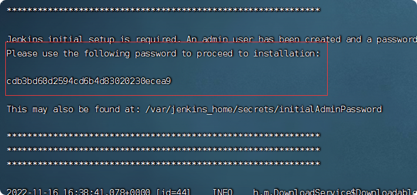

# 集成Jenkins自动部署
为了偷懒，直接Jenkins自动拉取gitlab项目自动部署
## 安装Jenkins

    docker run \
        --name jenkins \
        --privileged=true -d \
        -v /usr/local/jenkins_home:/var/jenkins_home \
        -p 8090:8080 \
        -p 50000:50000 \
    jenkins/jenkins
    
    
    chmod -R 777 /usr/local/jenkins_home

    
**参数解析：**

- --name jenkins：指定 Jenkins 容器名称
- --privileged=true：防止docker容器没有权限
- -d：容器在后台启动
- -v /usr/local/jenkins_home:/var/jenkins_home：将容器的/var/jenkins_home 映射到本机的/usr/local/jenkins_home目录，为了便于管理Jenkins容器的数据，需要注意的是，挂载出来的目录允许我们往容器里面添加文件或者目录，也就是在`/usr/local/jenkins_home:/var/jenkins_home`中添加的文件或者目录都会被映射到容器目录`/var/jenkins_home`，那么我们最终在`Jenkins`中配置软件环境时应当使用容器目录路径，因为`Jenkins`实际上是在容器中跑的，比如JDK家目录，你放在/usr/local/jenkins_home/jdk_home，那么最终配置应当写成/var/jenkins_home/jdk_home
- -p 8090:8080 -p 50000:50000：将容器的8080端口映射到本机的8090端口，5000端口映射为5000端口
- jenkins/jenkins：指定镜像名称跟 tag

## 得到初始密码
    
    docker logs -f jenkins 
    最后有段密文就是初始密码，复制下来
    
 
 

## 访问配置
1.访问地址：密码就是前面的初始密码

    cdb3bd60d2594cd6b4d83020230ecea9
    
    http://192.168.171.132:8090/

2.我选择了安装推荐插件

