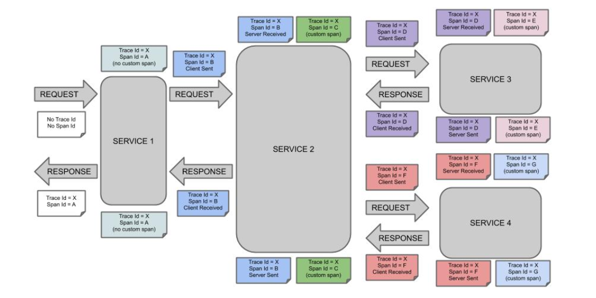
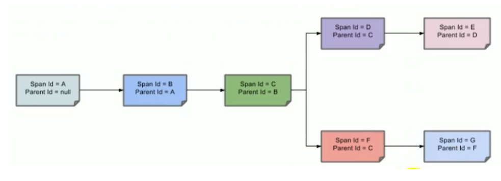
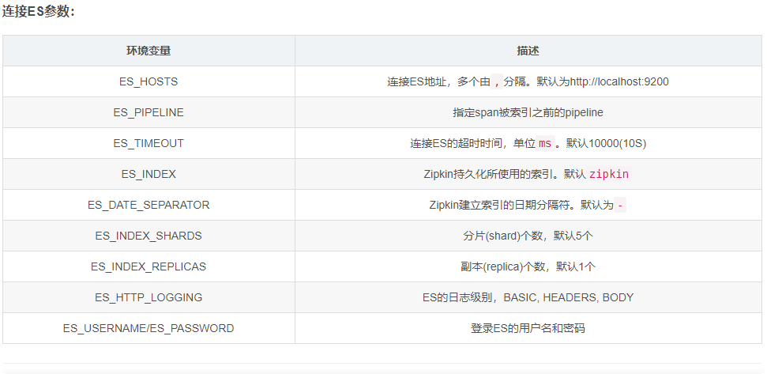
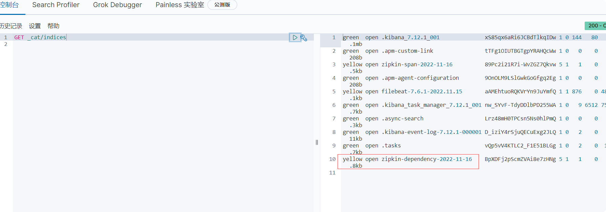

# 集成sleuth+zipkin链路追踪

[sleuth文档](https://spring.io/projects/spring-cloud-sleuth)

[started](https://docs.spring.io/spring-cloud-sleuth/docs/3.1.0/reference/html/getting-started.html#getting-started)

[zipkin文档](https://zipkin.io/)
## 概念
微服务架构是一个分布式架构，它按业务划分服务单元，一个分布式系统往往有很多个服务单元。由于服务单元数量众多，业务的复杂性，如果出现了错误和异常，很难去定位。主要体现在，一个请求可能需要调用很多个服务，而内部服务的调用复杂性，决定了问题难以定位。所以微服务架构中,必须实现分布式链路追踪,去跟进一个请求到底有哪些服务参与，参与的顺序又是怎样的，从而达到每个请求的步骤清晰可见，出了间题，很快定位。
链路追踪组件有Google的 Dapper，Twitter 的 Zipkin，以及阿里的Eagleeye（鹰眼）等，它们都是非常优秀的链路追踪开源组件。

## 介绍
- **Span(跨度)**:基本工作单元，发送一个远程调度任务就会产生一个 Span，Span是一个64位ID唯一标识的，Trace是用另一个64位IlD唯一标识的，Span还有其他数据信息，比如摘要、时间戳事件、Span的 ID、以及进度ID。【A->B->C调用，产生3个span，1个Trace】
- **Trace(跟踪)**:一系列Span 组成的一个树状结构。请求一个微服务系统的API接口，这个API接口，需要调用多个微服务，调用每个微服务都会产生一个新的Span，所有由这个请求产生的Span组成了这个Trace。
- **Annotation(标注）**:用来及时记录一个事件的，一些核心注解用来定义一个请求的开始和结束。这些注解包括以下:
  - **cs - Client Sent** -客户端发送一个请求，这个注解描述了这个Span 的开始【别人发给自己的时间】
  - **sr - Server Received** -服务端获得请求并准备开始处理它,如果将其sx减去cs时间戳便可得到网络传输的时间。【自己接收的时间】
  - **ss- Server Sent**（服务端发送响应）-该注解表明请求处理的完成(当请求返回客户端)，如果ss的时间戳减去s:时间默，就可以得到服务器请求的时间。【发给别人的时间】
  - **cr - Client Received**（客户端接收响应）-此时Span的结束，如果cr的时间戳减去cs时间默便可以得到整个请求所消耗的时间。【别人接收的时间】
  

## 整合Sleuth

### 1.依赖

    <dependency>
        <groupId>org.springframework.cloud</groupId>
        <artifactId>spring-cloud-starter-sleuth</artifactId>
    </dependency>
    
### 2.开启日志
    #yml新增
    # 在每个服务开启debug日志
    logging:
      file:
        #日志输出位置，配合elkf做日志收集
        path: D:/work/soft/online-match-logs
      level:
        com.kim.match: debug
        com.alibaba.nacos.client.config.impl: warn
        # feign调用日志，链路日志
        org.springframework.cloud.openfeign: debug
        # sleuth链路追踪日子输出到控制台
        org.springframework.cloud.sleuth: debug
        
## 整合Zipkin

### 1.docker安装zipkin服务器
    # 自动pullzipkin
    docker run -d \
        -p 9411:9411 \
        --name zipkin \
        --env ES_HOSTS=172.21.0.3:9200 \
        --env STORAGE_TYPE=elasticsearch \
        --env ES_INDEX=zipkin \
        --network=elkf_default \
    openzipkin/zipkin
    

**这里要更改网络，因为es在另一个网络里面，他们又在同一个机器。**

    
### 2.配置文件yml

      zipkin:
        # zipkin服务器的地址
        base-url: http://192.168.171.132:9411/
        # 关闭服务发现，否则Springcloud会把zipkin当做服务名称
        discovery-client-enabled: false
        # 数据传输方式
        sender:
          type: web
      sleuth:
        sampler:
          rate: 1 # 表示1秒钟采集一次，另外： 默认采样率为0.1，需要可以另行设置，但是这个优先级更高

### 3.配置类SleuthSamplerConfiguration
    
    /**
     * @Author: kimli
     * @Date: 2022/11/16 22:54
     * @Description: 解决使用zipkin项目启动死锁问题
     */
    @Configuration
    public class SleuthSamplerConfiguration {
        @Value("${spring.sleuth.sampler.rate}")
        private String probability;
    
        @Bean
        public Sampler defaultSampler() throws Exception {
            Float f = new Float(probability);
            SamplerProperties samplerProperties = new SamplerProperties();
            samplerProperties.setProbability(f);
            ProbabilityBasedSampler sampler = new ProbabilityBasedSampler(samplerProperties);
            return sampler;
        }
    }    
    
### 访问
    
    192.168.171.132:9411
    
### zipkin数据持久化到ES
    如果是连接ES集群，--ES_HOSTS通过逗号分割，比如：--ES_HOSTS=http://1.1.1.1:9200,http://2.2.2.2:9200
    
    docker run \
    --env STORAGE_TYPE=elasticsearch \
    --env ES_HOSTS=172.21.0.3:9200 \
    --network=elkf_default\
    openzipkin/zipkin-dependencies     
    

### es查询index

