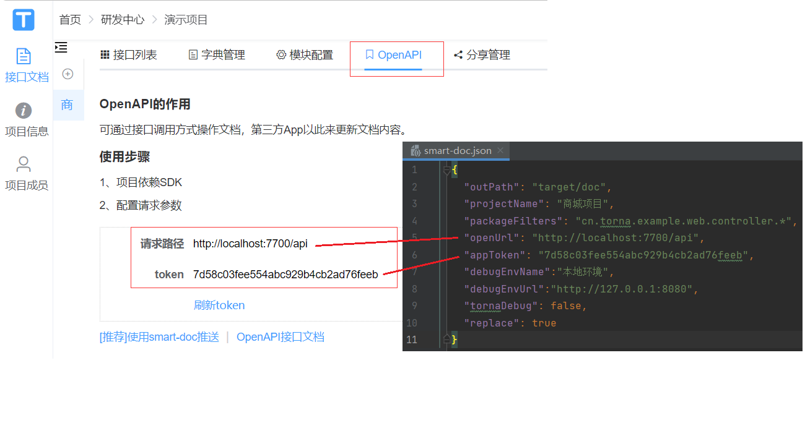
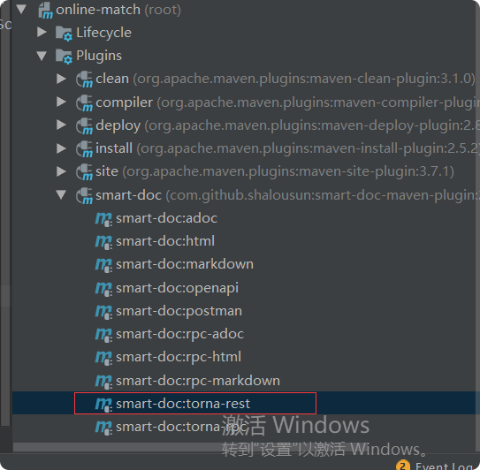

# 微服务集成smart-doc
背景：以前一直使用swaagger，但是感觉代码入侵太大了。以后架构试试smart-doc+Torna 这套轻量级框架

Smart-Doc的gitee地址：https://gitee.com/smart-doc-team/smart-doc
Torna的gitee地址：https://gitee.com/durcframework/torna

## docker安装torna1.16.2

### 1.镜像
    docker pull tanghc2020/torna:1.16.2
### 2.数据卷
    mkdir -p -m 777 /usr/local/torna/config    
    
### 3.创建torna数据库
数据库sql地址：https://gitee.com/durcframework/torna/blob/master/mysql.sql#

> 注意：远程mysql账号要开启远程连接
    
    GRANT ALL PRIVILEGES ON *.* TO 'root'@'%' IDENTIFIED BY '123456' WITH GRANT OPTION;
    
    FLUSH PRIVILEGES;
    
### 4.创建application.properties文件放入到//usr/local/torna/config中

    cd /usr/local/torna/config
    
    vim application.properties
    
    
编写配置文件
    
    # 服务端口
    server.port=7700
     
    # 数据库连接配置
    mysql.host=10.0.0.4:3306
    mysql.schema=torna
    mysql.username=root
    mysql.password=123456
     
    # 允许注册
    torna.register.enable=true
    # jwt有效期，即多少天内不用再次登录
    torna.jwt.timeout-days=365
    # jwt秘钥，可使用UUID，确保唯一性即可
    torna.jwt.secret=CHezCvjte^WHy5^#MqSVx9A%6.F$eV
    # 创建后台用户初始密码
    torna.user.initial-password=123456
    # 日志文件路径
    logging.file.name=log/server.log
     
    # 单文件大小限制
    spring.servlet.multipart.max-file-size=20MB
    # 总请求量大小限制
    spring.servlet.multipart.max-request-size=100MB
     
    # 推送是否允许相同文件夹名称
    torna.push.allow-same-folder=true
    # 推送打印内容
    torna.push.print-content=false
     
     
    # 返回参数表格需要隐藏的列，多个用逗号隔开
    # 列选项：required,maxLength
    torna.view-config.response-hidden-columns=required,maxLength
    # 初始排序值
    torna.view-config.init-order=10000 
    
### 5.创建torna容器

    docker run --name torna --restart=always \
      -p 7700:7700 \
      -e JAVA_OPTS="-Xms256m -Xmx256m" \
      -v /usr/local/torna/config:/torna/config \
      -d tanghc2020/torna:1.16.2
      

### 访问
    
    http://192.168.171.132:7700/
    
    admin 123456
 

## smart-doc整合
### 1.顶层pom文件添加插件
    
     <!-- smart-doc插件 -->
        <plugin>
            <groupId>com.github.shalousun</groupId>
            <artifactId>smart-doc-maven-plugin</artifactId>
            <version>2.4.9</version>
            <configuration>
                <!--指定生成文档的使用的配置文件-->
                <configFile>${basedir}/src/main/resources/smart-doc.json</configFile>
                <!--指定项目名称-->
                <projectName>商城项目</projectName>
            </configuration>
            <executions>
                <execution>
                    <phase>package</phase>
                </execution>
            </executions>
        </plugin>
        
        
smart-doc的原理是扫描源码文件，然后解析注释，因此必须确保有源码。如果有些公共类放在第三方jar，确保第三方jar上传到maven私服连带源码一起上传。  

然后再smart-doc插件中的<configuration>节点下新增如下配置  

    
    <!--includes配置用于配置加载外部依赖源码,配置后插件会按照配置项加载外部源代码而不是自动加载所有，因此使用时需要注意-->
    <!--smart-doc能自动分析依赖树加载所有依赖源码，原则上会影响文档构建效率，因此你可以使用includes来让插件加载你配置的组件-->
    <includes>
        <!--格式为：groupId:artifactId;参考如下-->
        <!--也可以支持正则式如：com.alibaba:.* -->
        <include>your groupId:your artifactId</include>
        <!-- 如果配置了includes的情况下， 使用了mybatis-plus的分页需要include所使用的源码包 -->
        <include>com.baomidou:mybatis-plus-extension</include>
        <!-- 如果配置了includes的情况下， 使用了jpa的分页需要include所使用的源码包 -->
        <include>org.springframework.data:spring-data-commons</include>
    </includes>
    

### 2.在每个服务中的resources下添加一个smart-doc.json文件
内容如下：

    {
      "outPath": "target/doc",
      "projectName": "某某服务接口",
      "packageFilters": "com.kim.match.user.controller.*",
      "openUrl": "http://192.168.171.132:7700/api",
      "appToken": "16e8bd2c99b14cd59ee853d8613ab22e",
      "debugEnvName":"本地环境",
      "debugEnvUrl":"http://localhost:88/api/user",
      "tornaDebug": true,
      "replace": true
    }
    
    
参数说明:

- outPath：固定填这个不用变
- projectName：项目名称
- packageFilters：Controller接口对应的package目录，多个用;隔开
- openUrl：Torna中的OpenAPI接口
- appToken：Torna中的OpenAPI token
- debugEnvName：Torna中调试环境名称
- debugEnvUrl：Torna中调试环境地址
- tornaDebug：是否开启调试，初次使用建议开始，后面稳定了关闭
- replace：是否替换文档，建议tr

### 使用
    
