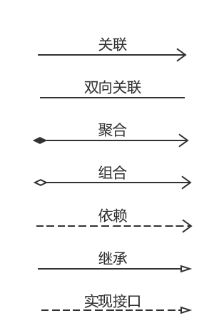
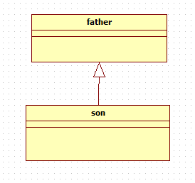
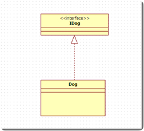
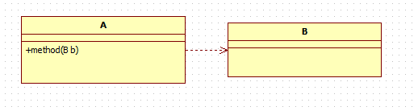
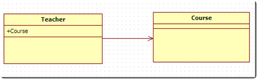
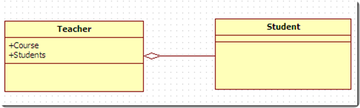
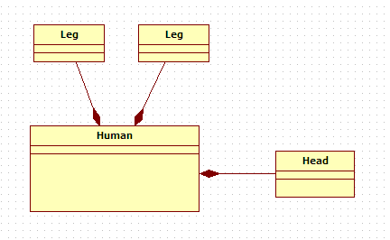

# 设计模式
## 三种类型
    创建型模式   共五种：
        工厂方法模式、抽象工厂模式、单例模式、建造者模式、原型模式。
        结构型模式   共七种：
        代理模式、适配器模式、装饰器模式、桥接模式、外观模式、组合模式、享元模式。
    行为型模式   共十一种：
        策略模式、模板方法模式、观察者模式、迭代子模式、责任链模式、命令模式、备忘录模式、   
        状态模式、访问者模式、中介者模式、解释器模式。  
## 基本原则
    共七种:单一职责、接口隔离、依赖倒转、开闭原则ocp、里氏替换、迪米特原则（最少知道原则 ）、合成复用原则
## 六种关系
    依赖、继承（泛型）、实现、关联、聚合、组合  
## UML类图
### UML类图的箭头
  
  

   >泛化/继承： 
  
    概念：泛化是一种一般与特殊、一般与具体之间关系的描述，具体描述建立在一般描述的基础之上，
        并对其进行了扩展。在java中用来表示继承的关系。
    表示方法：用实线空心三角箭头表示。      
  
    
   >实现/接口：
  
    概念：实现是一种类与接口的关系，表示类是接口所有特征和行为的实现，在程序中一般通过类实现接口来描述
    表示方法：空心三角形箭头的虚线，实现类指向接口
  
  
   >依赖
      
      概念：是一种使用的关系，即一个类的实现需要另一个类的协助。
            java中，方法参数需要传入另一个类的对象，就表示依赖这个类。
      表示方法：虚线箭头，类A指向类B。
   
   
   >关联
   
       概念：表示类与类之间的联接,它使一个类知道另一个类的属性和方法，
           这种关系比依赖更强、不存在依赖关系的偶然性、关系也不是临时性的，一般是长期性的。
           java中一个类的全局变量引用了另一个类，就表示关联了这个类
       表示方法：实线箭头，类A指向类B
   
   
   >聚合
   
       概念：聚合关联关系的一种特例，是强的关联关系。聚合是整体和个体之间的关系，
           即has-a的关系，整体与个体可以具有各自的生命周期，部分可以属于多个整体对象，
           也可以为多个整体对象共享。程序中聚合和关联关系是一致的，只能从语义级别来区分；
       表示方法：尾部为空心菱形的实线箭头（也可以没箭头），类A指向类B
       
   
   >组合
   
       概念：组合也是关联关系的一种特例。组合是一种整体与部分的关系，即contains-a的关系，比聚合更强。
            部分与整体的生命周期一致，整体的生命周期结束也就意味着部分的生命周期结束，组合关系不能共享。
            程序中组合和关联关系是一致的，只能从语义级别来区分。
       表示方法：尾部为实心菱形的实现箭头（也可以没箭头），类A指向类B
       