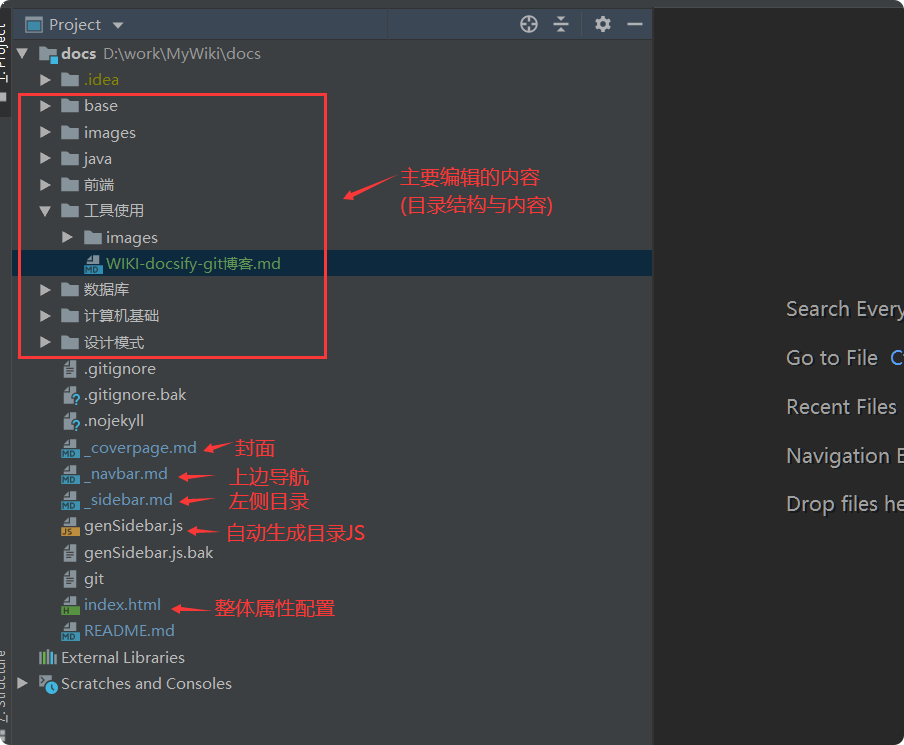
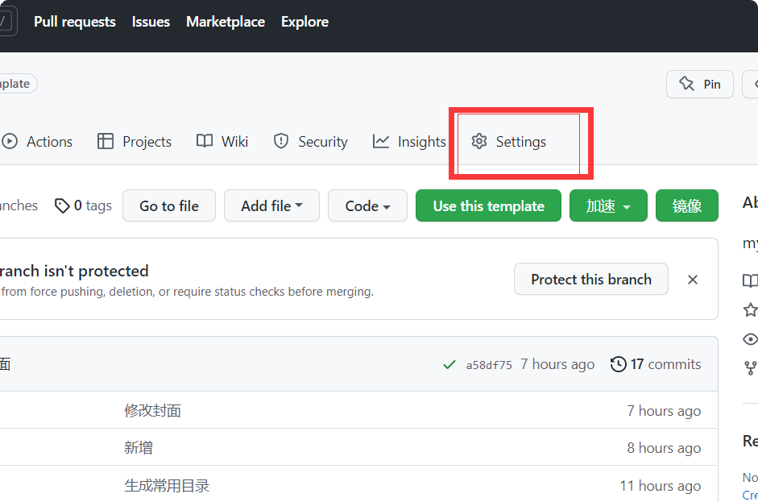
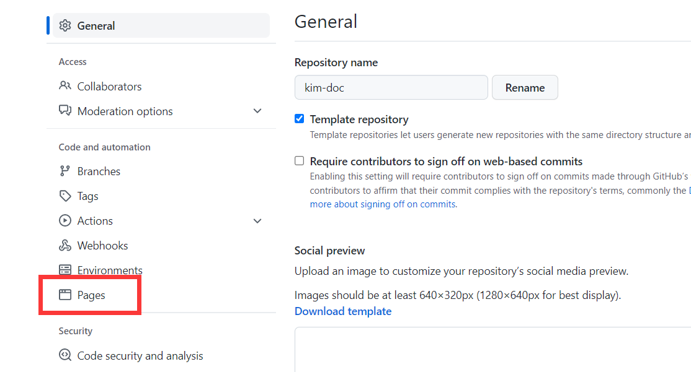
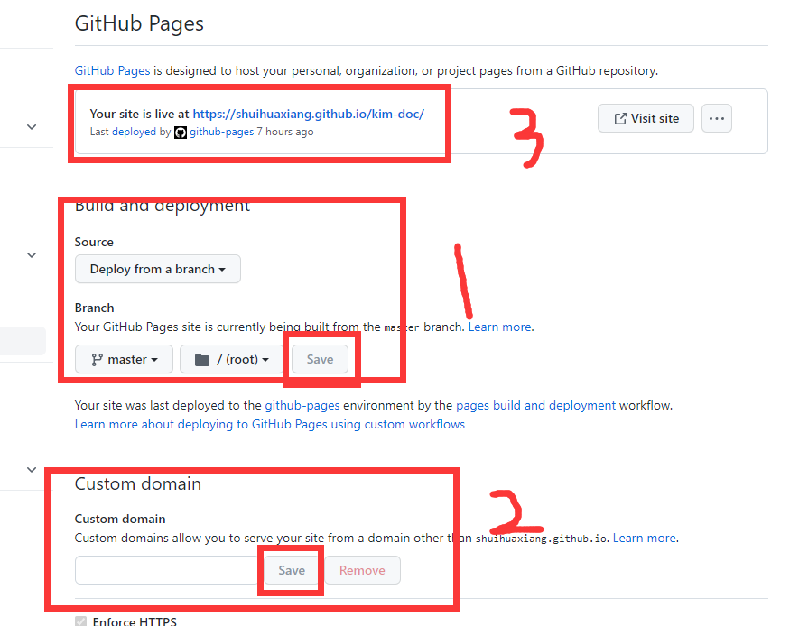
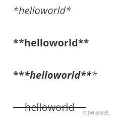
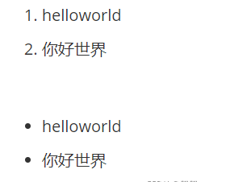

# WIKI-docsify-git博客
## 基本安装与搭建
搭建方案博客推荐：[使用docsify+Git搭建自己的WiKi网站](https://mp.weixin.qq.com/s/CBsg8fcCawYq2LuJcwRH3Q)
        
       idea导入编辑docs文件
       新增idea插件：
            图片复制/粘贴：markdown-image-support 
> 工程结构            
                      
***
## docsify-index配置
index.html里面的内容：  
```html
<!DOCTYPE html>
<html lang="en">

<head>
  <meta charset="UTF-8">
  <title>路口下车-学习笔记</title>
  <meta http-equiv="X-UA-Compatible" content="IE=edge,chrome=1" />
  <meta name="description" content="Description">
  <meta name="viewport" content="width=device-width, user-scalable=no, initial-scale=1.0, maximum-scale=1.0, minimum-scale=1.0">
  <link rel="stylesheet" href="//cdn.jsdelivr.net/npm/docsify/lib/themes/vue.css">
    <!--折叠目录css-->
  <link rel="stylesheet" href="//cdn.jsdelivr.net/npm/docsify-sidebar-collapse/dist/sidebar.min.css" />
  <link rel="stylesheet" href="//cdn.jsdelivr.net/npm/docsify-sidebar-collapse/dist/sidebar-folder.min.css" />
<body>
  <div id="app"></div>
  <script>
    window.$docsify = {
      name: '路口下车-学习笔记',
      repo: 'https://github.com/shuihuaxiang/kim-doc.git',
      loadSidebar:true,// 增加：自动加载侧边栏
      // alias: {
      //   '/.*/_sidebar.md': '/_sidebar.md'
      // },
      subMaxLevel:1,//增加生成目录的层级
      sidebarDisplayLevel: 1,
      loadNavbar:true,//开启导航栏
      mergeNavbar: true, // 小屏设备下合并导航栏到侧边栏
      subMaxLevel: 4,// 自定义侧边栏后默认不会再生成目录，设置生成目录的最大层级（建议配置为2-4）
      // 搜索框的完整配置参数
      search: {
        maxAge:86400000, // 过期时间，单位毫秒，默认一天
        paths: 'auto', // or 'auto'
        placeholder: '输入内容检索',
        noData: '未检索到结果',
        depth: 6,// 搜索标题的最大层级, 1 - 6
        hideOtherSidebarContent: false, // 是否隐藏其他侧边栏内容
      },
      coverpage: true,//封面
      count:{
        countable:true,
        fontsize:'0.9em',
        color:'rgb(90,90,90)',
        language:'chinese'
      }
    }

  </script>
  <!-- Docsify v4 -->
  <script src="//cdn.jsdelivr.net/npm/docsify/lib/docsify.min.js"></script>
  <!-- emoji表情支持 -->
  <script src="//cdn.jsdelivr.net/npm/docsify/lib/plugins/emoji.min.js"></script>
  <!-- 图片放大缩小支持 -->
  <script src="//cdn.jsdelivr.net/npm/docsify/lib/plugins/zoom-image.min.js"></script>
  <!-- 搜索功能支持 -->
  <script src="//cdn.jsdelivr.net/npm/docsify/lib/plugins/search.min.js"></script>
  <!--在所有的代码块上添加一个简单的Click to copy按钮来允许用户从你的文档中轻易地复制代码-->
  <script src="//cdn.jsdelivr.net/npm/docsify-copy-code/dist/docsify-copy-code.min.js"></script>
  <!-- 分页导航插件-->
  <script src="//cdn.jsdelivr.net/npm/docsify-pagination/dist/docsify-pagination.min.js"></script>
  <!-- 字数统计插件-->
  <script src="//unpkg.com/docsify-count/dist/countable.js"></script>
  <!--折叠目录-->
  <script src="//cdn.jsdelivr.net/npm/docsify-sidebar-collapse/dist/docsify-sidebar-collapse.min.js"></script>
</body>
</html>
```
***
## 发布到GitHub-生成pages
1. 使用idea，push到GitHub
2. 生成可访问的页面  
   选择Settings -> 选择左侧Pages -> 配置然后save得到网址
   
   
   
   
   
***
## markdown常用语法
### 一、标题   
  
    语法说明：#+空格+标题
            （写几个#，代表几级标题，最多支持到六级标题）
  

### 二、字体
    
     语法说明：
            *+内容+*  -->  斜体
            **+内容+**  --> 加粗
            ***+内容+***  --> 斜体加粗
            ~~+内容+~~  --> 删除线  （“~”在“Tab”键上面）

### 三、引用

    语法说明：>+空格  （双击回车退出引用）


### 四、分割线

    语法说明：---（减号键）或者 ***

### 五、图片

    语法说明：
    （“[]”内的图片名称可有可无。在输入左括号的时候会自动跳转到插入图片的格式）

### 六、超链接 
    
     语法说明：[超链接说明]()

### 七、列表

     语法说明：
    
            有序列表：数字+.+空格+内容
            无序列表：-（减号/短横线）+空格+内容
           （回车会自动添加一行，双击回车退出列表）

### 八、表格
    
     语法说明：
    
            原生操作：列名1 | 列名2 | 列名3         （第一行为表头）
    
                              --- | --- | ---        （第二行作用为分割表头和主体）
    
                              内容1 | 内容2 | 内容3         （第三行及以后都是表的主体）
    
            （文字或者减号和管道号“|”之间有没有空格都可以）
 
  例如：  
   学号|姓名|
   ---|----|
   1|张三|
   2|李四|
   3|王五|   
### 九、代码块
 语法说明：```+编程语言  （ ` 为英文输入格式下的波浪号键，在Tab键上面）   
 例如：  
```java
    public class Test{
    public static void main(String[] args){
        System.out.println("hello world");
       }
    }
 ```
### 更多内容
推荐参考博客：
[markdown使用与语法](https://book.itxueyuan.com/BA9P/nrne)
