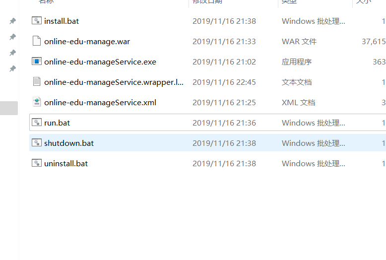
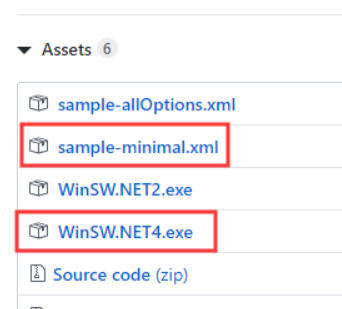

# springboot项目生成服务自动运行
## 文件目录

**文件内容** 以项目名称为online-edu-manageService为例
> install.bat

    online-edu-manageService.exe install

> uninstall.bat

    online-edu-manageService.exe uninstall
    
> run.bat

    net start online-edu-manageServiceName
> shutdown.bat
    
    net stop online-edu-manageServiceName
> online-edu-manage.war
    
    打包的springboot项目
> online-edu-manageService.exe
   
1.下载winsw，地址： https://github.com/kohsuke/winsw/releases    
   

2.修改文件名称

    WinSW.NET4.exe修改为online-edu-manageService.exe  
    sample-minmal.xml修改为online-edu-manageService.xml  
    

> online-edu-manageService.xml
    
    <configuration>
      <!-- ID of the service. It should be unique accross the Windows system-->
      <id>online-edu-manageID</id>
      <!-- Display name of the service -->
      <name>online-edu-manageServiceName</name>
      <!-- Service description -->
      <description>online-edu-manage</description>
      
      <!-- Path to the executable, which should be started -->
      <executable>java</executable>
        <arguments>-Xmx256m -jar online-edu-manage.war</arguments>
        <logmode>rotate</logmode>
    </configuration>

>
>
>
>  

        